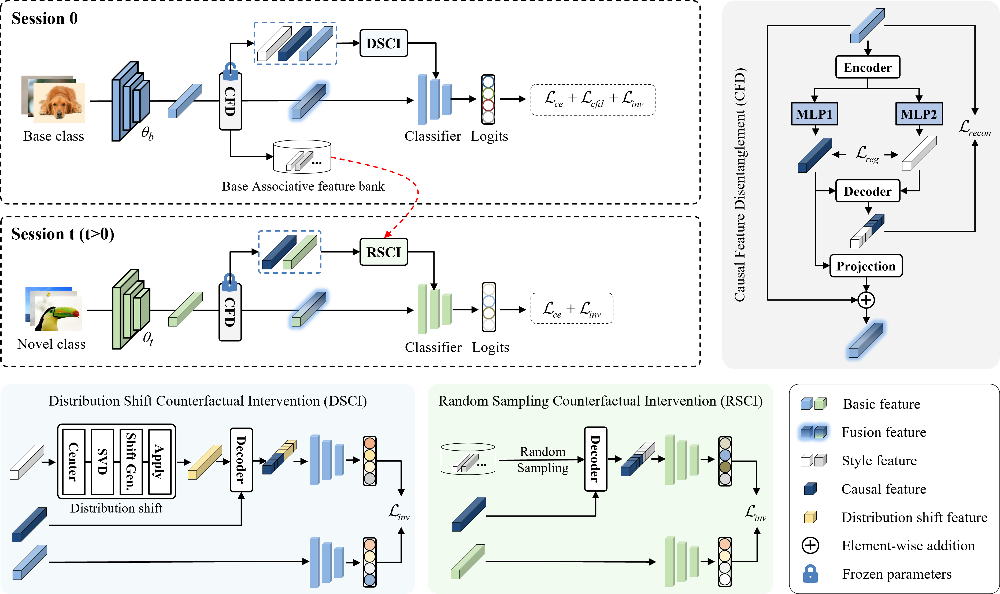
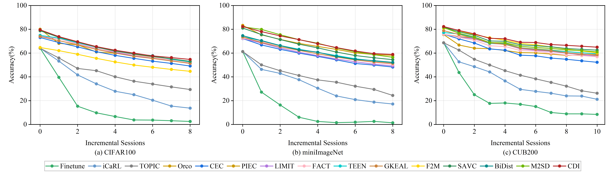

# Counterfactual Distribution Intervention for Few-Shot Class-Incremental Learning

## Abstract
Few-Shot Class-Incremental Learning (FSCIL) focuses on enabling models to learn new classes from limited samples while preventing catastrophic forgetting of previously acquired knowledge. Existing methods often fail to differentiate between intrinsic class features and irrelevant background correlations, making models sensitive to shifts in data distribution during incremental learning, which limits their ability to generalize. To tackle this issue, we propose the Counterfactual Distribution Intervention (CDI) framework, which focuses on learning robust feature representations by mitigating non-discriminative interference through causal intervention. The framework consists of three key modules: In the base-class phase, Causal Feature Decoupling (CFD) explicitly separates features into causal and stylistic components. Building on this, Distribution-Shifted Counterfactual Intervention (DSCI) applies structured intervention to stylistic features, forcing the model to learn distribution-invariant causal representations. During the incremental stage, Random Sampling Counterfactual Intervention (RSCI) repurposes base-class style features to generate diverse counterfactual samples, efficiently utilizing limited data while maintaining feature stability. Extensive experiments on three benchmark datasets—CUB-200, CIFAR-100, and mini-ImageNet—demonstrate that the CDI framework significantly outperforms existing state-of-the-art methods, confirming its effectiveness in improving model generalization and preventing forgetting.


## Pipeline
<p align="center">
  
</p>

## Results
<p align="center">
  
</p>

## Environment
The system I used and tested in

- Ubuntu 20.04.5 LTS
- NVIDIA GeForce RTX 3090
- Pytorch 1.12.1

## Requirements

To install requirements:

```
pip install -r requirements.txt
```

## Datasets
For miniImagenet and CUB200, Please refer to [CEC](https://github.com/icoz69/CEC-CVPR2021)  to prepare the dataset.
For CIFAR100, the dataset will be download automatically.

## Training scripts
- CUB-200
```
python train.py \
    -project cdi \
    -dataset cub200 \
    -base_mode 'ft_cos' \
    -new_mode 'protonet_cos' \
    -gamma 0.1 \
    -lr_base 0.002 \
    -lr_new 0.03 \
    -decay 0.0005 \
    -epochs_base 120 \
    -schedule Milestone \
    -milestones 60 80 100 \
    -gpu 5,6 \
    -temperature 16 \
    -moco_dim 128 \
    -moco_k 8192 \
    -mlp \
    -moco_t 0.07 \
    -moco_m 0.999 \
    -size_crops 224 96 \
    -min_scale_crops 0.2 0.05 \
    -max_scale_crops 1.0 0.14 \
    -num_crops 2 4 \
    -constrained_cropping \
    -alpha 0.2 \
    -beta 0.8 \
    -fantasy rotation2 \
    -use_counterfactual \
    -counterfactual_weight 0.2 \
    -counterfactual_alpha 0.8 \
    -causal_weight 0.3 \
    -counterfactual_mode domain_shift \
    -incft
```

- CIFAR-100
```
python -m torch.distributed.launch  --nproc_per_node=1 --use_env --master_port 29503 main.py fscil_cifar100 --model vit_base_patch16_224 --batch-size 25 --d_prompt_length 10 --length 10 --data-path ./data --output_dir ./output
```

